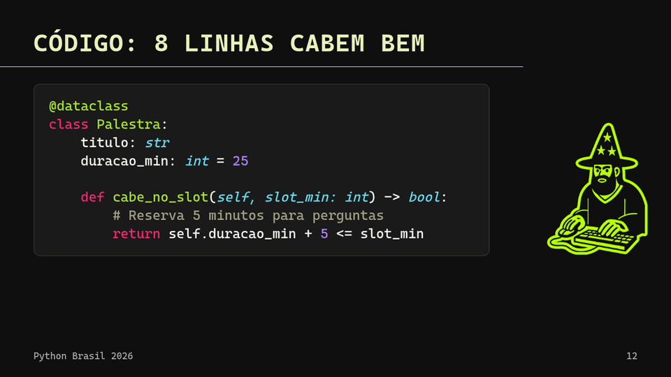
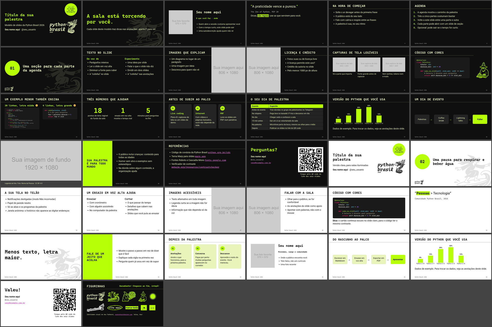
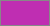

# Slides da Python Brasil 2026 em Markdown

Português · [English](README.en.md) · [Español](README.es.md)

Escreva o conteúdo da sua palestra para a [Python Brasil 2026](https://2026.pythonbrasil.org.br/) do seu jeito, em Markdown puro, e deixe um agente de IA cuidar da forma. O seu agente favorito lê o [`AGENTS.md`](AGENTS.md) e formata os slides com os layouts, as cores e as regras da marca. Cada push publica a apresentação no GitHub Pages, com um PDF junto.

Os blocos de código saem coloridos sozinhos. Escreva ` ```python ` e o código, e o tema aplica as cores do Monokai num cartão escuro, com a fonte Cascadia Mono, nos slides escuros e nos claros. Não precisa copiar o código de outro site nem colar imagem.



O tema usa o [Marp](https://marp.app/) e a identidade visual do evento: cores, fontes, logo e figurinhas.

Prefere PowerPoint, LibreOffice ou Google Slides? Use o [modelo em `.pptx`](https://github.com/rodbv/pybr2026-slides).

Os slides de exemplo existem em três idiomas, com as mesmas dicas:

| Idioma | Arquivo | Ver |
|---|---|---|
| Português | `slides.md` | [no navegador](https://rodbv.github.io/pybr2026-marp-teste/) · [PDF](https://rodbv.github.io/pybr2026-marp-teste/slides.pdf) |
| English | `slides.en.md` | [no navegador](https://rodbv.github.io/pybr2026-marp-teste/en.html) · [PDF](https://rodbv.github.io/pybr2026-marp-teste/slides.en.pdf) |
| Español | `slides.es.md` | [no navegador](https://rodbv.github.io/pybr2026-marp-teste/es.html) · [PDF](https://rodbv.github.io/pybr2026-marp-teste/slides.es.pdf) |



## Começar

1. Clique em **Use this template > Create a new repository**. Deixe o repositório público: o GitHub Pages é grátis para repositórios públicos.
2. No repositório novo, abra **Settings > Pages** e escolha **GitHub Actions** em **Source**.
3. Na aba **Actions**, abra a execução "pages", que falhou porque o Pages ainda estava desligado, e clique em **Re-run all jobs**. A partir daí, cada push na `main` publica os slides e os PDFs.
4. Na página do repositório, clique na engrenagem de **About** e marque **Use your GitHub Pages website**. O link dos seus slides fica no topo do repositório.
5. Fique só com o arquivo do idioma da sua palestra. Se ela for em português, apague `slides.en.md` e `slides.es.md`. Se for em inglês ou espanhol, apague os outros dois e renomeie o seu para `slides.md`. Assim a palestra sai na raiz do site.

Na sua cópia, os links da tabela acima apontam para o seu site. Os slides ficam em `https://SEU-USUARIO.github.io/NOME-DO-REPOSITORIO/` e o PDF em `.../slides.pdf`. Sem o Pages, o PDF também fica para baixar em cada execução da aba Actions, no artefato **slides-pdf**.

Esse endereço serve para o QR code do encerramento: o público abre os seus slides no celular.

As caixas cinza dos slides de exemplo marcam o lugar das imagens e mostram o tamanho que preenche o espaço. Troque o caminho da imagem no Markdown pelo da sua.

O modelo é um ponto de partida: mude o que quiser. Para manter a cara do evento, use as cores e as fontes da marca, listadas em [Cores e fontes](#cores-e-fontes).

## Cores e fontes

| | Cor | Hex | RGB | Uso |
|---|---|---|---|---|
|  | Preto | `#0F0F0F` | 15, 15, 15 | Fundo escuro, texto no fundo claro |
|  | Off-white | `#E8F4BA` | 232, 244, 186 | Texto no fundo escuro |
|  | Verde limão | `#B7FF06` | 183, 255, 6 | Destaque; como cor de texto, só no fundo escuro |
|  | Violeta | `#BF2EB2` | 191, 46, 178 | Links no fundo claro |

| Fonte | Uso |
|---|---|
| [Cascadia Mono](https://fonts.google.com/specimen/Cascadia+Mono) | Títulos e código |
| [Roboto](https://fonts.google.com/specimen/Roboto) | Texto |

## Com um agente de IA

O conteúdo é seu: escreva o roteiro da palestra num arquivo, em tópicos, rascunho ou texto corrido. Depois, abra o repositório no seu editor com o agente e peça a forma. Por exemplo:

```
Meu roteiro está em roteiro.md. Monte os slides em slides.md, no lugar dos
exemplos, usando os layouts e as cores do modelo: capa, agenda, uma seção para
cada parte e o encerramento. Uma ideia por slide, o código em blocos com
realce, e o que eu vou falar nas anotações. Não invente conteúdo: se faltar
alguma coisa, me pergunte.
```

O `AGENTS.md` diz ao agente quais layouts existem, como escrever cada um, e as regras da marca e do conteúdo: até 8 linhas de código por slide, texto alternativo em toda imagem, limão como cor de texto só no fundo escuro, linguagem neutra de gênero. O `CLAUDE.md` aponta para o mesmo arquivo.

Depois, peça ajustes como faria a uma pessoa: "divida o slide 7 em dois", "troque a tabela por um fluxo", "deixe as anotações mais curtas".

## No VS Code

1. Abra a pasta do repositório. O VS Code sugere a extensão **Marp for VS Code**: instale.
2. Abra o `slides.md` e clique no botão de visualização, no canto superior direito. O tema já vem configurado.
3. Para exportar, use **Marp: Export Slide Deck** na paleta de comandos e escolha HTML, PDF ou PPTX. O PDF e o PPTX precisam do Chrome, do Edge ou do Firefox instalado.

Também dá para editar o `slides.md` direto no GitHub, pelo navegador: a Action publica do mesmo jeito.

## Apresentar

Abra o endereço do GitHub Pages ou o HTML exportado no navegador.

- **F**: tela cheia.
- **P**: abre a visão do apresentador numa janela nova, com as anotações, o próximo slide e o cronômetro. As duas janelas andam juntas: deixe a do apresentador na sua tela e a dos slides no projetor. Para sair, feche a janela do apresentador.
- Setas ou espaço: próximo slide.

Leve também o PDF num pendrive: ele abre em qualquer computador, sem internet.

## Layouts

Cada slide escolhe o layout com um comentário no topo, como `<!-- _class: secao -->`. Os exemplos do `slides.md` mostram todos eles, e o [`AGENTS.md`](AGENTS.md) traz o Markdown que cada um espera.

| Classe | Para |
|---|---|
| (nenhuma) | Título e tópicos, tabela, código ou imagem |
| `capa` | Título da palestra, nome e o selo da data |
| `frase` | Uma frase só, grande |
| `secao` | Divisor com o número no disco limão |
| `duas-colunas` | Antes e depois, problema e solução, dois trechos de código |
| `numeros` | Três números grandes com rótulo |
| `cartoes` | Três blocos numerados com título e descrição |
| `fluxo` | Passos em caixas ligadas por setas |
| `tres-imagens` | Três capturas de tela com legenda |
| `palestrante` | Foto, nome, cargo e três fatos |
| `destaque` | Painel limão com a mensagem que a sala não pode perder |
| `imagem-cheia` | Foto de fundo com faixa de legenda |
| `encerramento` | "Perguntas?" ou "Valeu!", contatos e QR code |
| `figurinhas` | Logo, figurinhas, círculo pixelado e marca-texto |
| `light` | Versão clara de qualquer layout: `<!-- _class: frase light -->` |

Para texto ao lado de uma imagem, use a sintaxe do Marp: ``.

## Gráfico e QR code

O Marp não tem gráfico nativo. Os scripts em `scripts/` geram as imagens nas cores da marca, com [uv](https://docs.astral.sh/uv/):

```sh
uv run scripts/qr.py https://seu-usuario.github.io/sua-palestra/
uv run scripts/grafico.py
```

O `qr.py` troca o `img/qr.png`. O `grafico.py` gera o gráfico de exemplo com matplotlib, no estilo do tema: troque os rótulos e os valores no script e rode de novo.

## Acessibilidade

- O texto do corpo tem 36 px num slide de 1280 px, o mesmo que 20 pt no modelo em `.pptx`. Nada abaixo de 18 pt para quem senta longe.
- Todas as combinações de cor do tema passam no nível AA do WCAG 2.1. As cores e o contraste de cada uma estão no [README do modelo em `.pptx`](https://github.com/rodbv/pybr2026-slides#cores-e-contraste).
- O idioma do documento é português do Brasil, para leitores de tela.
- Escreva o texto alternativo entre os colchetes de cada imagem: ``.

## Achou um problema?

Abra uma [issue no GitHub](https://github.com/rodbv/pybr2026-marp/issues) contando o que aconteceu e, se puder, com uma captura de tela.

## Licenças

- Modelo, textos de exemplo e código deste repositório: [CC0 1.0](LICENSE) (domínio público). Use, mude e compartilhe sem pedir permissão nem dar crédito.
- Logo, figurinhas e identidade visual: Python Brasil 2026 e APyB, do manual de marca oficial do evento, criado por [Ana Terhorst](https://anaterhorstdesign.com).
- Fontes Roboto e Cascadia Mono: SIL Open Font License 1.1, carregadas do Google Fonts.
