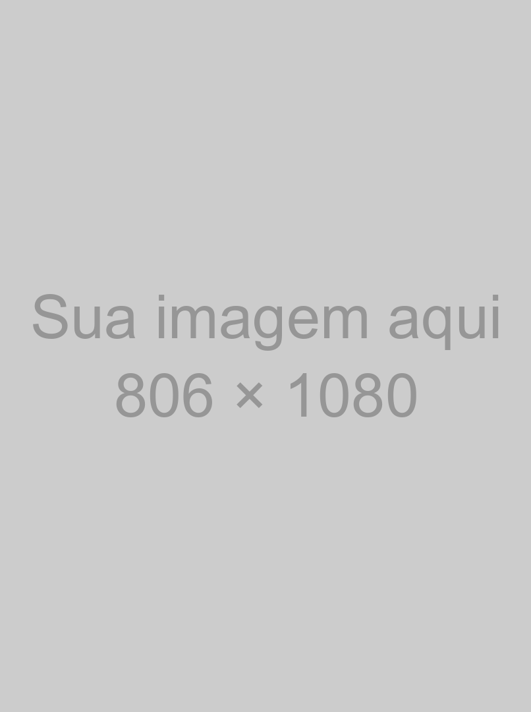
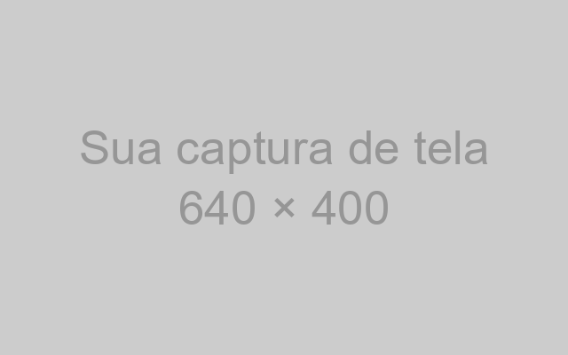
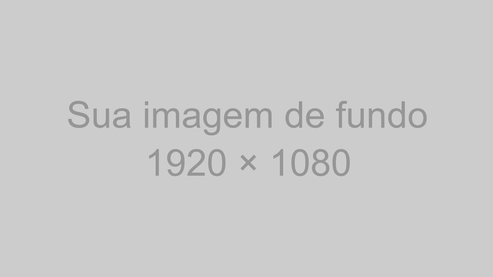

<!-- _class: capa -->
<!-- _paginate: false -->
<!-- _footer: "" -->

<div class="selo">14 a 19<br>de outubro<br>de 2026<br>{Floripa/SC}</div>

# Título da sua palestra

Modelo de slides da Python Brasil 2026

**Seu nome aqui** · @seu_usuario

<!--
- Que bom que você vai palestrar! O seu jeito de falar vale mais do que qualquer dica deste modelo.
- Este arquivo é um modelo: cada slide de exemplo mostra um layout e traz dicas nas anotações. Use as que servirem para você.
- Para começar: guarde uma cópia sem mudanças, escolha a versão escura ou a clara e copie os slides que quiser usar. O comentário _class no topo de cada slide escolhe o layout.
- Ao reaproveitar um slide, apague estas anotações e escreva as suas.
-->

---

<!-- _class: frase -->

# A sala está torcendo por você.

Cada slide deste modelo traz dicas nas anotações: aperte P para ver.

<!--
- Uma ideia por slide, em até duas linhas. Que frase o público deve levar da sala?
- Quase toda pessoa palestrante fica nervosa. Se bater o nervosismo, fale para um rosto amigo na plateia.
-->

---

<!-- _class: palestrante -->


# Seu nome aqui

### O que você faz · onde

- Quem abre a sessão costuma apresentar você
- Com o tempo curto, este slide pode sair
- Uma autodescrição ajuda quem não vê

<!--
- Troque a caixa cinza pela sua foto: no Markdown, troque img/foto-exemplo.png pelo caminho da sua foto.
- Quem abre a sessão costuma apresentar você; com o tempo curto, este slide pode sair.
- Uma autodescrição ajuda quem não vê, por exemplo: “Sou a Maria, tenho 1,60 m, cabelo preto solto, óculos verdes e uma camiseta da PyLadies.”
-->

---

> Legibilidade conta.

The Zen of Python, PEP 20

Dicas, <mark>não regras</mark>: use as que servirem para você.

<!--
- Até três linhas, com quem disse e onde. Vale conferir a autoria numa fonte primária.
- As aspas verdes vêm do tema: comece a linha da citação com > e escreva sem aspas.
-->

---

## Na hora de começar

- Solte o ar devagar antes da primeira frase
- O público está do seu lado
- Fale com calma e respire entre as frases
- A palestra é sua, no seu ritmo

<!--
- De três a cinco tópicos por slide. Se o texto não couber, divida o conteúdo em dois slides.
-->

---

## Agenda

1. A agenda mostra o caminho da palestra
2. Três a cinco partes costumam bastar
3. Volte a este slide entre uma parte e outra
4. Cada parte pode abrir com um slide de seção
5. Opcional: pode sair se o tempo for curto

<!--
- A numeração é automática.
- Voltar à agenda entre as partes ajuda o público a saber onde está.
-->

---

<!-- _class: secao -->
<!-- _paginate: false -->
<!-- _footer: "" -->

# _01_ Uma seção para cada parte da agenda

<!--
- O número entre sublinhados vai para o disco limão: # _01_ Título. O número acompanha a ordem da agenda.
-->

---

<!-- _class: duas-colunas -->

## Texto no slide

### Em vez de

- Parágrafos inteiros
- Ler o slide em voz alta
- Diminuir a fonte para caber
- A “colinha” no slide

### Experimente

- Uma ideia por slide
- Falar o que o slide não diz
- Dividir em dois slides
- A “colinha” nas anotações

<!--
- Cada coluna tem o seu título: antes e depois, problema e solução.
- O detalhe e a “colinha” vão para as anotações, que só você vê.
-->

---

## Imagens que explicam



- Um diagrama no lugar de um parágrafo
- Uma imagem por ideia
- Descreva para quem não vê

<!--
- A caixa cinza marca o lugar da sua imagem: troque img/imagem-exemplo.png pelo caminho da sua. Com , o texto ocupa o resto do slide.
- Escreva o texto alternativo entre os colchetes de cada imagem que não seja de fundo.
- Na fala, diga o que a imagem mostra, para quem não enxerga e para quem ouve a gravação.
-->

---

## Licença e crédito


- Fotos suas ou de licença livre
- A licença permite este uso?
- Crédito da autoria no slide
- Pelo menos 1000 px de altura

<!--
- Uma foto na vertical preenche este espaço; uma foto na horizontal aparece recortada nas laterais. Troque left por right para a imagem ir à direita.
- Confira se a licença da foto permite o uso numa palestra gravada e dê o crédito no formato “Foto: nome, licença, site”.
-->

---

<!-- _class: tres-imagens -->

## Capturas de tela legíveis

-  Só a parte que importa
-  Fonte grande antes de capturar
-  Sem senhas, tokens nem e-mails

<!--
- Troque cada caixa cinza pela sua captura de tela: troque img/captura-exemplo.png pelo caminho da captura e descreva a captura entre os colchetes.
- Antes de capturar a tela, aumente o zoom do navegador ou a fonte do terminal.
- Confira se a captura mostra senhas, tokens, e-mails, abas ou notificações.
-->

---

## Código com cores

```python
@dataclass
class Palestra:
    titulo: str
    duracao_min: int = 25

    def cabe_no_slot(self, slot_min: int) -> bool:
        # Reserva 5 minutos para perguntas
        return self.duracao_min + 5 <= slot_min
```


<!--
- Se a sua palestra não tem código, pode pular este slide.
- Até 8 linhas e 60 colunas. Se o trecho for maior, divida em slides ou mostre só o que importa.
- O Marp colore o código sozinho: abra o bloco com ```python, ou com a linguagem do trecho.
-->

---

<!-- _class: duas-colunas miuda -->

## Um exemplo menor também ensina

### Muito pequeno para ler 😟

```python
from dataclasses import dataclass
from datetime import datetime, timedelta

@dataclass
class Palestra:
    titulo: str
    inicio: datetime
    duracao_min: int = 25

    @property
    def fim(self) -> datetime:
        return self.inicio + timedelta(minutes=self.duracao_min)

    def conflita_com(self, outra: "Palestra") -> bool:
        return self.inicio < outra.fim and outra.inicio < self.fim

    def cabe_no_slot(self, slot_min: int) -> bool:
        # Reserva 5 minutos para perguntas
        return self.duracao_min + 5 <= slot_min
```

### Dá para ler do fundo 😊

```python
def cabe(palestra, slot):
    # 5 min para perguntas
    fim = palestra.duracao + 5
    return fim <= slot
```

<!--
- Antes e depois de uma refatoração, ou duas formas de resolver o mesmo problema.
- Cada coluna aceita até 30 colunas. A da esquerda, com a classe miuda, mostra como fica a letra miúda no telão.
- Emoji também é recurso: um rosto triste ou feliz diz na hora qual lado é o exemplo a evitar. O título diz o mesmo em palavras, para quem não vê o emoji.
-->

---

<!-- _class: numeros -->

## Três números que ajudam

- **18** pontos de letra: legível do fundo da sala
- **1** ensaio em voz alta mostra o tempo real
- **5** minutos para perguntas no fim

<!--
- Até três números, cada um com um rótulo do que mede.
- O número vai em negrito no começo do item: - **18** rótulo.
-->

---

<!-- _class: cartoes -->

## Antes de subir ao palco

1. **Live coding** Plano B: capturas de tela ou um vídeo da demo.
2. **Internet** Com vídeos e páginas baixados, você não depende da rede.
3. **PDF** Leve os slides em PDF num pendrive.

<!--
- Escolha o plano B que combina com a sua palestra e ensaie a troca para ele no seu computador.
- Com palestras emendadas, nem sempre dá para testar o som; um vídeo legendado funciona sem áudio.
-->

---

## O seu dia de palestra

| Quando | Sugestão |
|---|---|
| Antes do evento | Tirar dúvidas no grupo de palestrantes no Telegram |
| Na véspera | Pega leve no karaokê :P Voz e descanso em dia |
| No dia | Chegar cedo e conhecer a sala |
| 15 min antes | Dar um oi ao voluntariado da sala |
| Na palestra | Microfone perto da boca, mesmo ao olhar para o telão |
| Depois | Publicar os slides no link do QR code |

<!--
- Tabelas em Markdown já saem com o cabeçalho limão.
- Testar em casa o adaptador de vídeo e o espelhamento de tela deixa o dia mais tranquilo.
- Cada sala tem alguém do voluntariado. Projetor, microfone, coragem: o que faltar, a gente ajuda.
-->

---

## Versão do Python que você usa


Dados de exemplo. Para trocar os dados, veja as anotações deste slide.

<!--
- O Marp não tem gráfico nativo: o gráfico é uma imagem gerada com matplotlib. Troque os rótulos e os valores em scripts/grafico.py e rode uv run scripts/grafico.py.
- Escreva os números do gráfico no texto alternativo, para leitores de tela.
- Um gráfico, uma mensagem: diga em voz alta o que o público deve ver nas barras.
-->

---

<!-- _class: fluxo -->

## Um dia de evento

1. Palestras
2. Coffee break
3. Lightning talks
4. PyBar

<!--
- Um fluxo mostra uma sequência: os passos de um processo, as etapas de um pipeline, a programação do dia.
- Conte o fluxo da esquerda para a direita: primeiro, depois, no fim.
-->

---

<!-- _class: imagem-cheia -->
<!-- _paginate: false -->
<!-- _footer: "" -->



Legenda da foto. Foto: Nome da Pessoa · CC BY 4.0

<!--
- Troque o arquivo em . A legenda é o último parágrafo do slide.
- Dê o crédito da foto na legenda, como no exemplo.
-->

---

<!-- _class: destaque -->

## Sua palestra é para todo mundo

- O público inclui crianças: conteúdo para todas as idades
- Humor sem alvo e exemplos sem estereótipos
- Na dúvida sobre algum conteúdo, a organização ajuda

<!--
- O código de conduta da Python Brasil vale para todas as pessoas no evento, inclusive no palco: python.org.br/cdc.
- Se você sofrer ou presenciar assédio, discriminação ou humilhação, procure a Equipe de Resposta.
-->

---

## Referências

- Código de conduta da Python Brasil [python.org.br/cdc](https://python.org.br/cdc)
- Tema Marp para slides [marp.app](https://marp.app)
- Fontes Roboto e Cascadia Mono [fonts.google.com](https://fonts.google.com)
- Verificador de contraste [webaim.org/resources/contrastchecker](https://webaim.org/resources/contrastchecker/)

<!--
- Um material por linha, com o nome e o endereço curto.
- Uma página só com todos os links (um README, um gist ou um Linktree) cabe num QR code no encerramento.
-->

---

<!-- _class: encerramento -->
<!-- _paginate: false -->
<!-- _footer: "" -->

# Perguntas?

**Seu nome aqui**
_@seu_usuario_
_voce@exemplo.com.br_


Troque pelo seu QR code: contato, slides ou site

<!--
- O QR code pode levar ao seu contato, aos seus slides ou a uma página com tudo isso. Com uma página só, você troca os links depois sem mudar o QR code.
- Para gerar o seu QR code: uv run scripts/qr.py https://seu-endereco. O script troca o arquivo img/qr.png. Depois, troque a legenda pelo link.
- Você já tem o necessário. Os próximos slides repetem os layouts na versão clara, com dicas opcionais.
-->

---

<!-- _class: capa light -->
<!-- _paginate: false -->
<!-- _footer: "" -->

<div class="selo">14 a 19<br>de outubro<br>de 2026<br>{Floripa/SC}</div>

# Título da sua palestra

Versão clara, para salas iluminadas

**Seu nome aqui** · @seu_usuario

<!--
- Em sala muito iluminada ou com projetor fraco, o fundo claro fica mais legível.
-->

---

<!-- _class: secao light -->
<!-- _paginate: false -->
<!-- _footer: "" -->

# _02_ Uma pausa para respirar e beber água

<!--
- Entre uma parte e outra, faça uma pausa: respire e beba um gole de água.
- A pausa parece longa para quem fala e curta para quem ouve.
-->

---

<!-- _class: light -->

## A sua tela no telão

- Notificações desligadas (modo Não incomodar)
- Papel de parede neutro
- Só as abas e os programas da palestra
- Janela anônima: o histórico não aparece ao digitar endereços

<!--
- O telão mostra tudo o que aparece na sua tela: ative o modo Não incomodar antes de subir ao palco.
- Numa janela anônima, o navegador não sugere endereços do histórico.
-->

---

<!-- _class: duas-colunas light -->

## Um ensaio em voz alta ajuda

### Ensaiar

- Com cronômetro
- Com alguém assistindo
- No computador da palestra

### Cortar

- O que passar do tempo
- Detalhes que cabem nas anotações
- Slides que você pula ao ensaiar

<!--
- Ensaiar em voz alta mostra o tempo real e deixa a fala mais solta.
-->

---

<!-- _class: light -->

## Imagens acessíveis


- Texto alternativo em toda imagem
- Legenda curta se a imagem não for óbvia
- Cor e emoji ajudam, mas não sozinhos

<!--
- Cores e emojis comunicam bem, mas não podem ser a única diferença: parte do público tem daltonismo, baixa visão ou usa leitor de tela.
- Junte a cor a um rótulo ou ícone: em vez de uma bolinha verde e uma vermelha, escreva também “passou” e “falhou”.
- Todo texto do modelo tem contraste de 4,5:1 ou mais com o fundo. Ao usar outras cores, confira em webaim.org/resources/contrastchecker.
-->

---

<!-- _class: light -->

## Falar com a sala


- Olhar para o público, se for confortável
- As anotações do slide como apoio
- Apontar com palavras, não com o mouse

<!--
- As anotações aparecem só para você na visão do apresentador. Olhar as anotações no palco é normal.
- No HTML exportado, aperte P: a visão do apresentador mostra as anotações, o próximo slide e o cronômetro.
-->

---

<!-- _class: light -->

## Código com cores

```python
@dataclass
class Palestra:
    titulo: str
    duracao_min: int = 25

    def cabe_no_slot(self, slot_min: int) -> bool:
        # Reserva 5 minutos para perguntas
        return self.duracao_min + 5 <= slot_min
```

**Dica:** o cartão continua escuro no slide claro, para o código ter o mesmo contraste.

<!--
- Para gerar o código colorido, veja as anotações do slide Código com cores, na parte escura.
-->

---

<!-- _class: light -->

> <mark>Pessoas</mark> &gt; Tecnologia

Comunidade Python Brasil, 2016

<!--
- No fundo branco, destaque a palavra principal com o marca-texto verde limão, <mark>palavra</mark>, e mantenha o texto preto.
- O lema da comunidade Python Brasil desde 2016.
-->

---

<!-- _class: frase light -->

# Menos texto, letra maior.

<!--
- Com menos texto no slide, a letra fica maior e a atenção do público fica em você.
-->

---

<!-- _class: destaque light -->

## Fale de um jeito que acolha

- Mostre o passo a passo em vez de dizer que é fácil
- Explique cada sigla na primeira vez
- Pergunte quem já usou em vez de supor

<!--
- O painel verde limão guarda a mensagem que a sala não pode perder, com até quatro tópicos curtos ao lado.
- Para quem está começando, “é só” e “todo mundo sabe” soam como “você deveria saber”.
- Para muita gente, a Python Brasil é a primeira conferência; um exemplo do dia a dia ajuda quem chegou agora.
-->

---

<!-- _class: cartoes light -->

## Depois da palestra

1. **Anotações** Anote o que funcionou, para a próxima palestra.
2. **Conversa** Fique por perto: muitas perguntas aparecem no corredor.
3. **Descanso** Aproveite o resto do evento. Você mereceu.

<!--
- Anotar logo depois o que funcionou ajuda na próxima palestra.
- Cansaço depois de palestrar é normal: descanse e aproveite o resto do evento.
-->

---

<!-- _class: palestrante light -->


# Seu nome aqui

### Pronomes, cargo e comunidade

- Onde o público encontra você
- Três fatos, não um currículo
- Uma foto recente

<!--
- Com os pronomes no slide, quem cita a sua palestra acerta como se referir a você.
-->

---

<!-- _class: fluxo light -->

## Do rascunho ao palco

1. Escrever em Markdown
2. Ensaiar em voz alta
3. Exportar em PDF
4. Apresentar

<!--
- Uma lista numerada vira caixas com setas; o último passo leva o limão.
- De três a cinco passos cabem numa linha. Para um fluxo com ramificações, divida em dois slides.
-->

---

<!-- _class: light -->

## Versão do Python que você usa


Dados de exemplo. Para trocar os dados, veja as anotações deste slide.

<!--
- Para trocar os dados, veja as anotações do slide Versão do Python que você usa, na parte escura.
-->

---

<!-- _class: encerramento light -->
<!-- _paginate: false -->
<!-- _footer: "" -->

# Valeu!

**Seu nome aqui**
_@seu_usuario_
_voce@exemplo.com.br_


Troque pelo seu QR code: contato, slides ou site

<!--
- Nas perguntas, repita cada pergunta no microfone, para a sala e a gravação.
- “Não sei, posso ver e te respondo depois” é uma boa resposta. Uma pergunta que desrespeita o código de conduta não precisa de resposta.
- Da organização: ficamos muito felizes por ter você na Python Brasil 2026. Conte com a gente: estamos aqui para apoiar você e torcer por você.
-->

---

<!-- _class: figurinhas -->
<!-- _paginate: false -->
<!-- _footer: "" -->

## Figurinhas

### Dazumbanho! Chegasse ao fim, ixtepô!

    

 <span class="circulo">olha aqui</span> <mark>marca-texto</mark>  

Identidade visual de Ana Terhorst, [anaterhorstdesign.com](https://anaterhorstdesign.com). Valeu, Ana!

<!--
- Copie a linha da figurinha para o seu slide; o w:200 define a largura em pixels.
- A figurinha marca-texto é um realce: troque a palavra dela, ou use <mark>palavra</mark> numa palavra sua. O círculo pixelado é <span class="circulo">palavra</span>.
- Uma figurinha por slide costuma bastar.
-->
